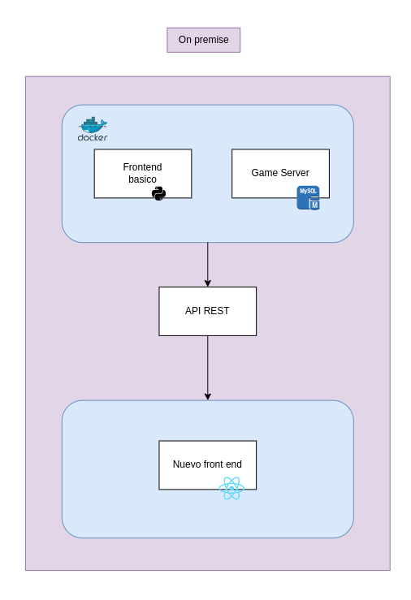

## En desarrollo.

Fiveserver
==========
Copyright (C) 2011-2021 juce and reddwarf
License: BSD-style

ABOUT
=====

Fiveserver is a pure-Python implementation of network server for the
following games:

Pro Evolution Soccer 5 
Winning Eleven 9
Winning Eleven 9 Liveware Evolution
Pro Evolution Soccer 6
Winning Eleven 2007

Notable features:

* Full support for network play, including 2-vs-2 for PES6
* Persistent accounts and full game statistics, stored in MySQL database
* Administrative web-interface
* REST api to retrieve live stats

INSTALL
=======

The following two-step installation sequence should work as is on any Unix OS,
such as Linux (any flavour), FreeBSD or Mac OSX. If you are using Windows, then
it is recommended that you download a pre-built Windows-specific package from 
http://sites.google.com/site/fiveservercom/

1. Python 3 and dependencies
If you are on modern Debian or Ubuntu Linux then this should install everything
you need:

    sudo apt-get -y update
    sudo apt-get install libmysqlclient-dev python3 python3-venv python3-dev gcc make

Otherwise, you will need to use your OS tools to install:

    * Python 3
    * libmysqlclient.
    * gcc or clang
    * make

2. Return to fiveserver source directory and install Python environment and
packages by issuing this command (as yourself, not root):

    make install

This will create an isolated Python environment and install all Python packages
needed to run Fiveserver/Sixserver

CONFIGURE MYSQL DATABASES
=========================

The following instructions assume that you can use a command-line mysql client 
utility to connect to your MySQL server with a root account.

For Fiveserver (PES5/WE9/WE9LE), you will need to create a database and grant
appropriate permissions. If you use default database name and login/password 
(you can change all of those in ./etc/conf/fiveserver.yaml), then it would be this:

    create database fiveserver;
    create user 'fiveserver'@'%' identified by 'we9le';
    grant select, insert, update on sixserver.* to 'fiveserver'@'%';
    use fiveserver;
    source ./sql/schema.sql

For Sixserver (PES6/WE2007), you will need to create a database and grant
appropriate permissions. If you use default database name and login/password 
(you can change all of those in ./etc/conf/sixserver.yaml), then it would be this:

    create database sixserver;
    create user 'sixserver'@'%' identified by 'proevo';
    grant select, insert, update on sixserver.* to 'sixserver'@'%';
    use sixserver;
    source ./sql/schema6.sql

USAGE
=====

The service.sh script can be used to run both services (fiveserver and sixserver) or
to launch them in the background. Just run the script without any arguments to see
all available options:

    ./service.sh 
    Usage ./service.sh {fiveserver|sixserver} {run|start|stop|status}

For example, to start fiveserver service, you would do:

    ./service.sh fiveserver start
